## Part 1. Инструмент ipcalc

Устанавливаем инструмент ipcalc.

**1.1) Сети и маски**

1) Адрес сети 192.167.38.54/13

 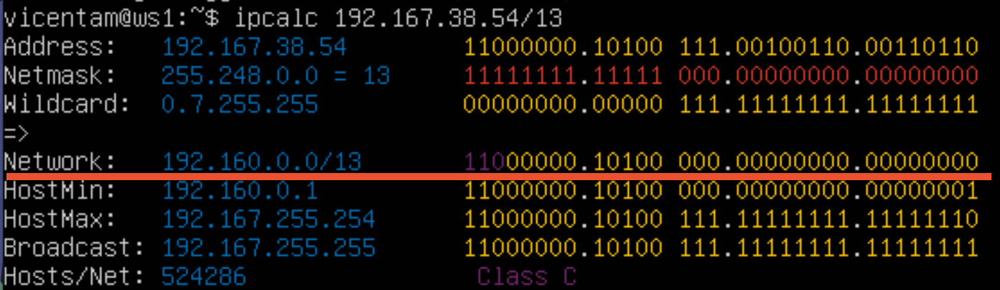

2) Перевод следующих масок в префиксную/обычную и двоичную запись

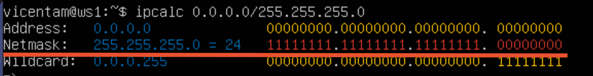
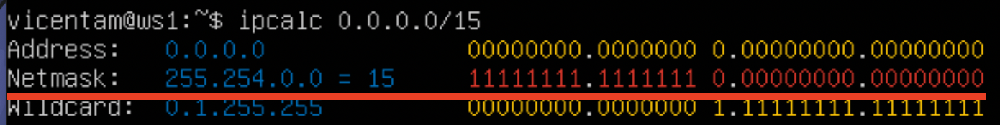
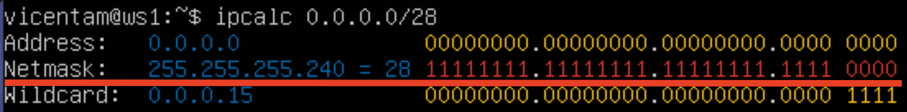

3) Минимальный и максимальный хост в сети 12.167.38.4 при следующих масках:

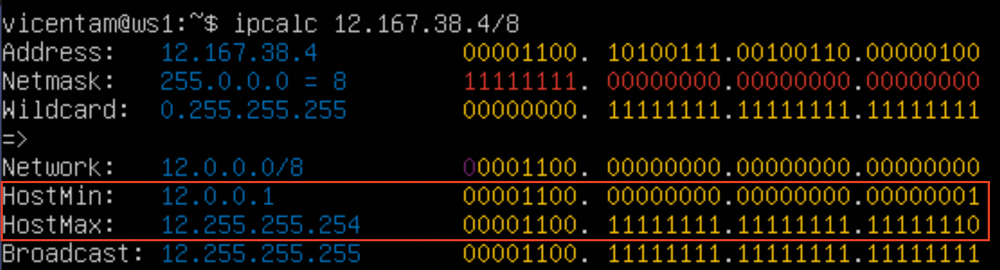
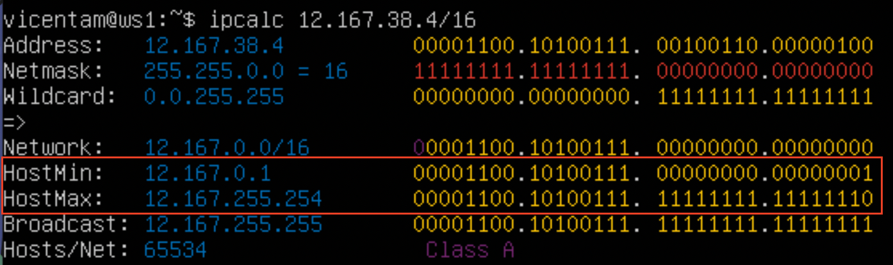
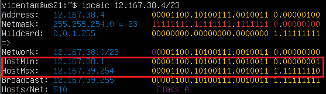
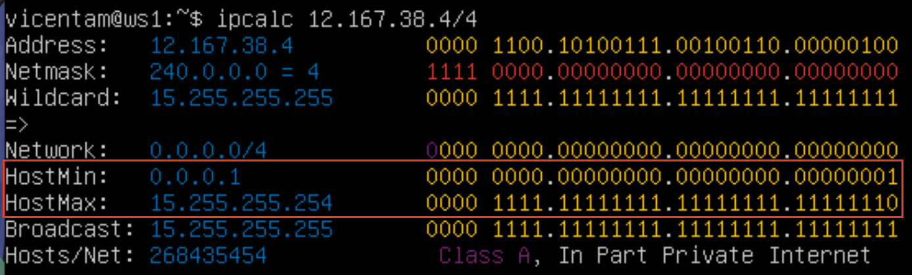

**1.2) localhost**

К приложению, работающему на localhost можно обратиться с: 
127.0.0.2, 127.1.0.1

Нельзя обратиться с:
194.34.23.100, 128.0.0.1

**1.3) Диапазоны и сегменты сетей**
- 1) IP адреса, которые можно использовать в качестве частных: 
10.0.0.45, 172.20.250.4, 192.168.4.2, 172.16.255.255, 10.10.10.10  - частные.
134.43.0.2, 172.0.2.1, 192.172.0.1, 172.68.0.2, 192.169.168.1 - публичные.

- 2) IP адреса, возможные у сети 10.10.0.0/18: 10.10.0.2, 10.10.10.10, 10.10.1.255
Невозможные: 10.0.0.1, 10.10.100.1

**Part 1. Статическая маршрутизация между двумя машинами**

С помощью команды `ip a` просматриваем существующие сетевые интерфейсы:

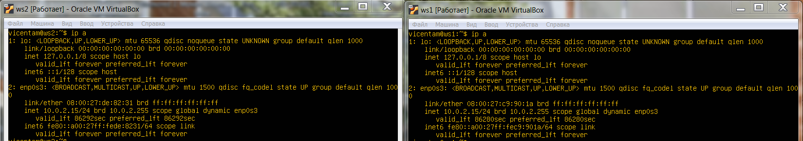

Сетевые конфигурации в `etc/netplan/00-installer-config.yaml`:

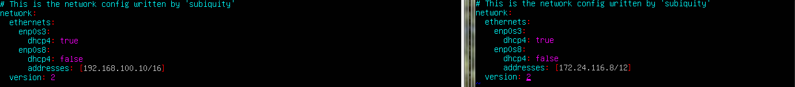

Выполняем команду `netplan apply` 

**2.1) Добавление статического маршрута вручную**

Добавляем маршрут от одной машины до другой и обратно при помощи команды `ip r add <IP адрес> dev <название интерфейса>`

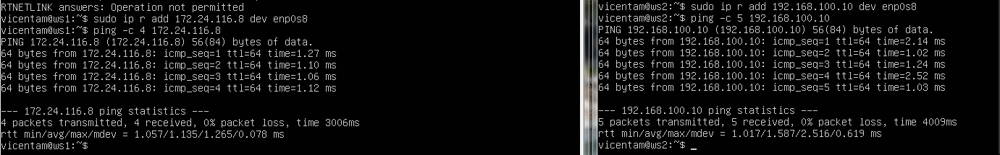

**2.2) Добавление статического маршрута с сохранением**

Добавляем маршруты от одной машины до другой с помощью файла `etc/netplan/00-installer-config.yaml`, затем применяем настройки `netplan apply`:

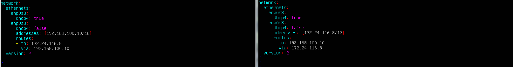

- Пингуем:

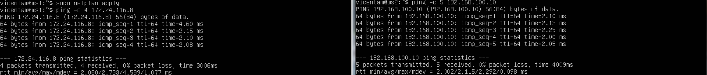

## Part 3. Утилита iperf3
**3.1) Скорость соединения**

8Mbps --> 1MB/s
100MB/s --> 819200Kbps
1Gbps --> 1024Mbps

**3.2) Утилита iperf3**
Измеряем скорость соединения между ws1 и ws2:

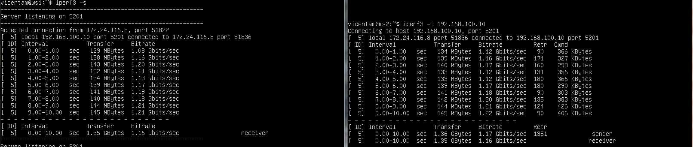

## Part 4. Сетевой экран
**4.1) Утилита iptables**

Создаём файл /etc/firewall.sh, имитирующий фаерволл, со следующими правилами:
1) на ws1 применить стратегию когда в начале пишется запрещающее правило, а в конце пишется разрешающее правило (это касается пунктов 4 и 5)
2) на ws2 применить стратегию когда в начале пишется разрешающее правило, а в конце пишется запрещающее правило (это касается пунктов 4 и 5)
3) открыть на машинах доступ для порта 22 (ssh) и порта 80 (http)
4) запретить echo reply (машина не должна "пинговаться”, т.е. должна быть блокировка на OUTPUT)
5) разрешить echo reply (машина должна "пинговаться")

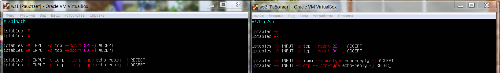

Результат выполнения скрипта:

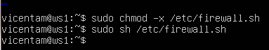

Пинг с ws1 до ws2:

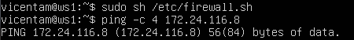

Пинг с ws2 до ws1:

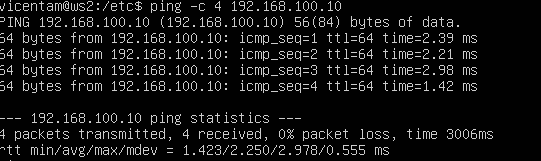

> Правила выполняться сверху-вниз, следовательно, если правило запрета находиться выше оно срабатывает, а правило разрешения находящиеся ниже нет.

 **4.2) Утилита nmap**

Командой `ping` найти машину, которая не "пингуется", после чего утилитой `nmap` показать, что хост машины запущен.

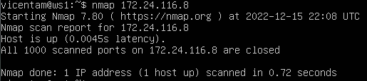

## Part 5. Статическая маршрутизация сети
**5.1) Настройка адресов машин**

Содержание файла `etc/netplan/00-installer-config.yaml` для каждой машины:

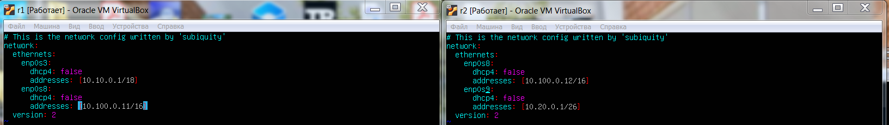

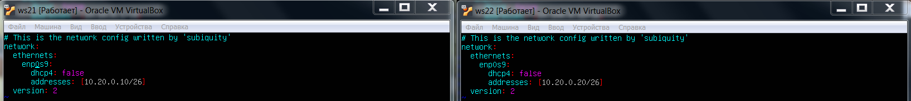

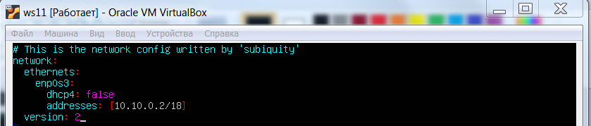

Результат выполнения команды `ip -4 a`

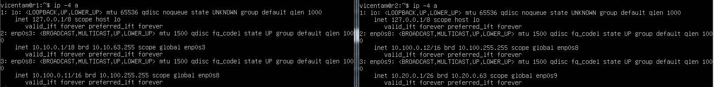

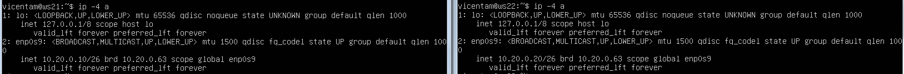

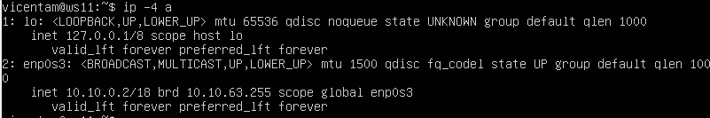

Пингуем ws22 с ws21 и пингуем r1 с ws11:

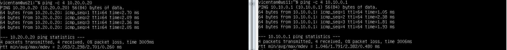

**5.2) Включение переадресации IP-адресов**

Для включения переадресации IP, выполняем команду на роутерах:
`sysctl -w net.ipv4.ip_forward=1`. 
Скриншот выполнения команды:

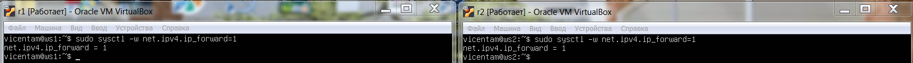

В файл `/etc/sysctl.conf` и добавляем следующую строку:
`net.ipv4.ip_forward = 1`

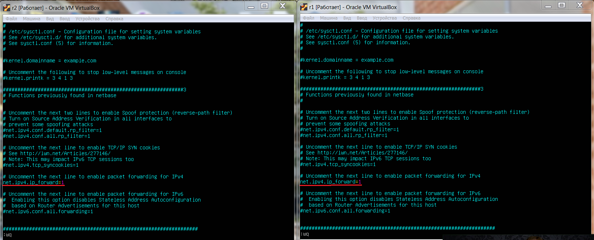

**5.3) Установка маршрута по-умолчанию**
Настраиваем шлюзы для рабочих станций:

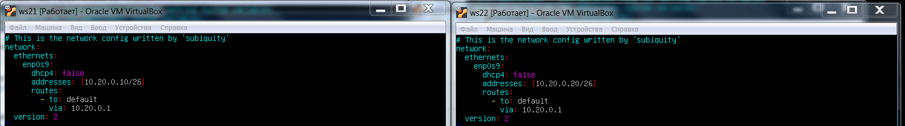

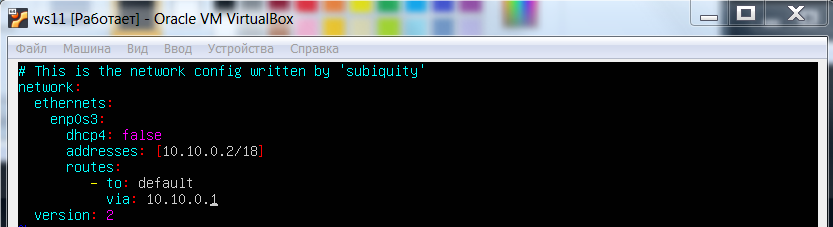

Вызываем `ip r` и убеждаемся, что маршрут добавился в таблицу маршрутизации:

Пингуем с ws11 роутер r2 и показать на r2. Убеждаемся, что это так с помощью команды: `tcpdump -tn -i <название интерфейса>

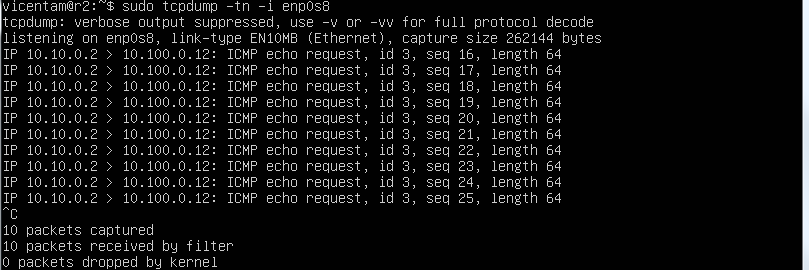

**5.4) Добавление статических маршрутов**

Перекидываем маршруты для роутеров r1 и r2:

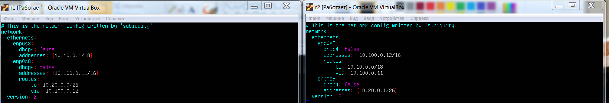

Вызываем `ip r` и убеждаемся, что маршруты добавлены в таблицу маршрутизации:

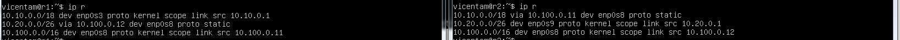

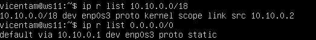

> Для адреса 10.10.0.0/18 был выбран маршрут отличный от 0.0.0.0/0, потому что роутер всегда предпочитает выбирает ту маску что больше, а также поскольку он является адресом сети и доступен без шлюза. 

**5.5) Построение списка маршрутизаторов**

Запустить на r1 команду дампа `tcpdump -tn -i <название интерфейса>`

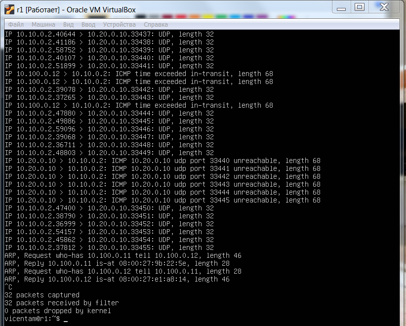

При помощи утилиты traceroute строим список маршрутизаторов на пути от ws11 до ws21

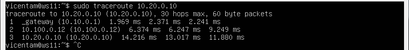

- Путь строиться от узла к узлу до того момента, покаа не будет достигнута конечная точка. Каждый пакет проходит на своем пути определенное количество узлов, пока достигнет своей цели. На каждом узле добавляется счетчик, который отслеживает количество пройденых узлов.

**5.6) Использование протокола ICMP при маршрутизации**

Запускаем на r1 перехват сетевого трафика, проходящего через enp0s8 с помощью команды `tcpdump -tn -i <название интерфейса>`
и пропингуем с ws11 несуществующий IP 10.30.0.111 с помощью команды:

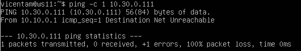

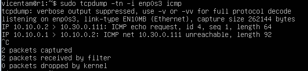

## Part 6. Динамическая настройка IP с помощью DHCP

Настраиваем для r2 конфигурацию службы DHCPв файле `/etc/dhcp/dhcpd.conf`

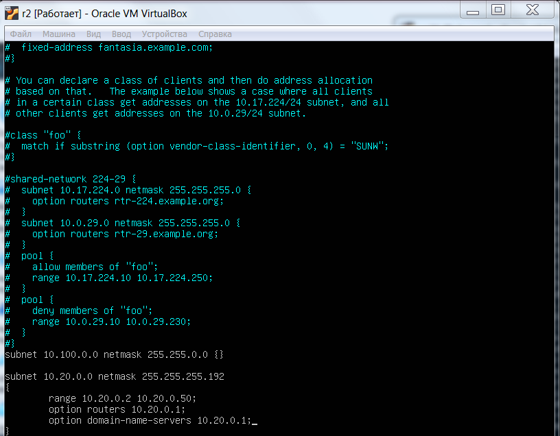

1) в файле `resolv.conf` прописываем `nameserver 8.8.8.8`

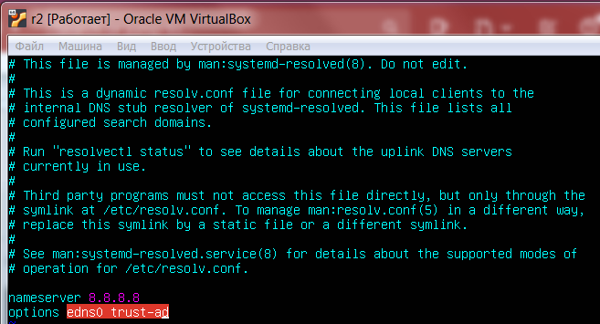

Перезагружаем службу DHCP командой `systemctl restart isc-dhcp-server`. 

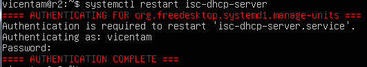

Убеждаемся, что DHCPD сервер включен `systemctl status isc-dhcp-server.service`

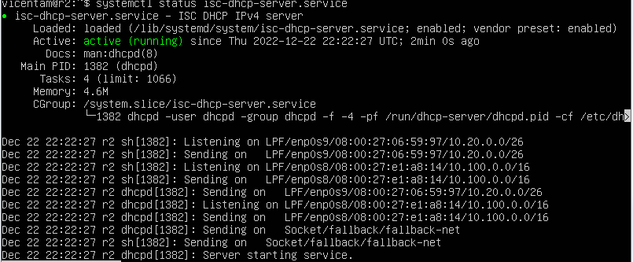

Машину ws21 перезагружаем при помощи reboot и с помощью `ip a` убеждаемся, что она получила адрес. 

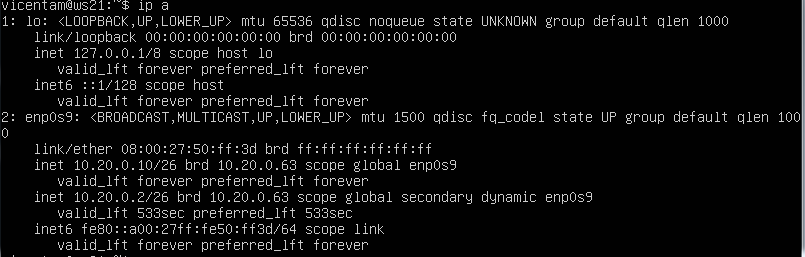

Пингуем ws22 с ws21.

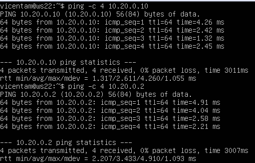

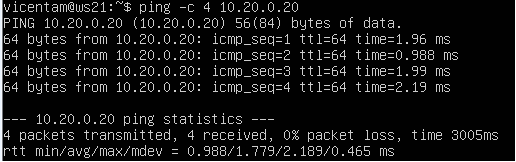

Указываем MAC адрес у ws11 и настраиваем аналогично r1 и r2:

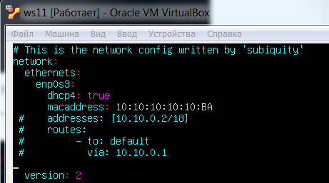

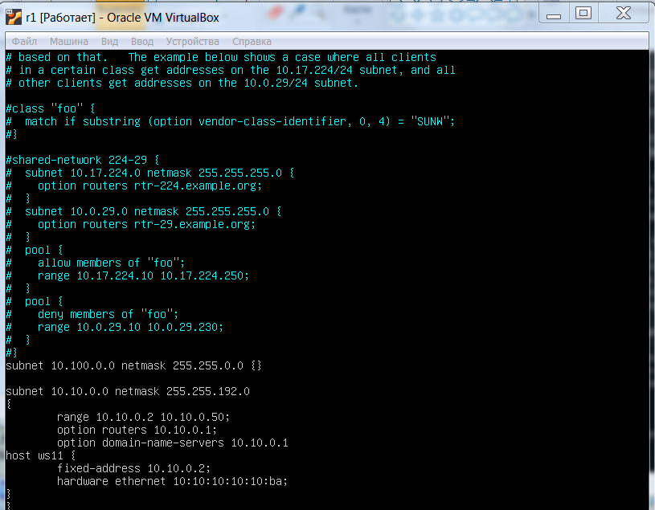

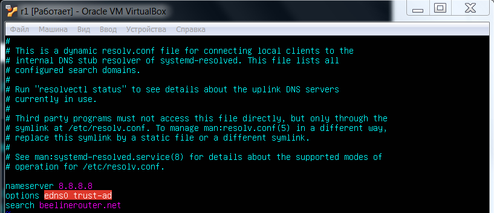

Запрашиваем с ws21 обновление ip адреса:
До обновления:

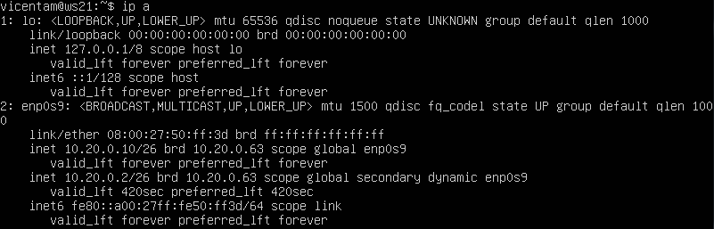

После обновления:

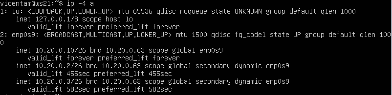

Какии опции DHCP сервера применялись: 

>sudo dhclient -r <интерфейс> -- освобождает текущий адрес интерфейса

>sudo dhclient -v (for verbose) <интерфейс> -- освобождает задает новый адрес

## Part 7. NAT
Сделаем сервер В файле Apache2 общедоступным. Для этого `/etc/apache2/ports.conf` на ws22 и r1 изменить строку `Listen 80` на `Listen 0.0.0.0:80.

Запускаем веб-сервер Apache:

Добавляем фаэрвол со следуюшими правилами:
>--Удаление правил в таблице filter - iptables -F

>--Удаление правил в таблице "NAT" - iptables -F -t nat

>--Отбрасывать все маршрутизируемые пакеты - iptables --policy FORWARD DROP

Запускаем фаэрвол и проверяем пинг между ws22 и r1:

При запуске файла с этими правилами, ws22 не должна "пинговаться" с r1

Разрешить маршрутизацию всех пакетов протокола ICMP

Проверить соединение между ws22 и r1 командой ping

Включаем SNAT.
Включаем DNAT на 8080 порт машины r2 и добавляем к веб-серверу Apache, запущенному на ws22, доступ извне сети.

Проверить соединение по TCP для SNAT:

Telnet из r1 в ws22:

Проверить соединение по TCP для DNAT:

Telnet из ws22 в r1:

## Part 8. Дополнительно. Знакомство с SSH Tunnels
Запускаем на r2 фаервол со следующими правилами:

>--Удаление правил в таблице filter - iptables -F

>--Удаление правил в таблице "NAT" - iptables -F -t nat

>--Отбрасывать все маршрутизируемые пакеты - iptables --policy FORWARD DROP

Запускаем веб-сервер Apache на ws22 только на localhost (то есть в файле `/etc/apache2/ports.conf` изменить строку `Listen 80` на `Listen localhost:80`

Воспользуемся Local TCP forwarding с ws21 до ws22, чтобы получить доступ к веб-серверу на ws22 с ws21

Воспользуемся Remote TCP forwarding c ws11 до ws22, чтобы получить доступ к веб-серверу на ws22 с ws11

Выполняем команду `telnet 127.0.0.1 [локальный порт]` во втором терминале:

